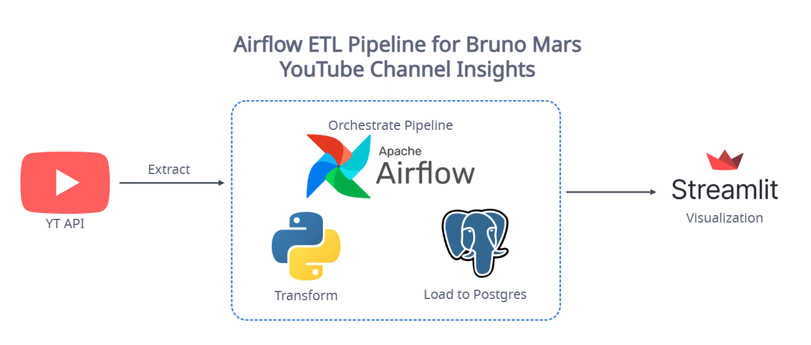

# Airflow ETL Pipeline for Bruno Mars YouTube Channel Insights

This project analyzes Bruno Mars YouTube Channel to gain insights about its performance on YouTube.

## Tech Stack
1. Data Ingestion
    - googleapiclient
2. Data Processing
    - Python
    - Pandas
3. Data Storage
    - PostgreSQL
4. Orchestration
    - Apache Airflow
5. Visualization
    - Streamlit

## Project Diagram Overview
